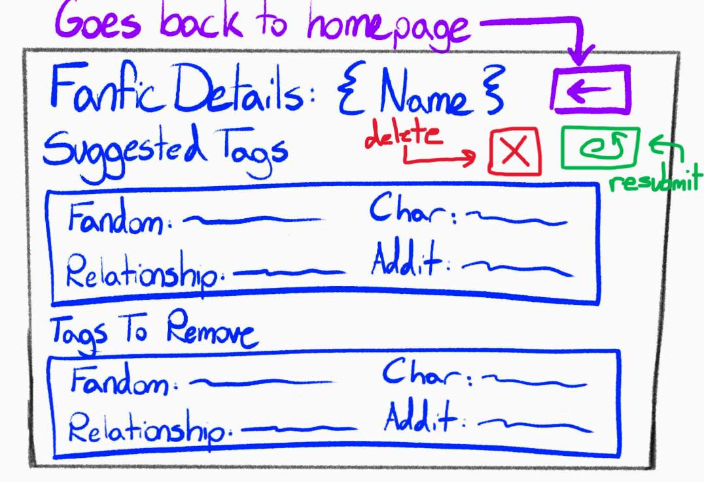

# Assignment 2

## Problem Statement

### Problem Domain: Fanfiction

Fanfiction is stories written by fans about media they like. Fanfiction is massively popular, with its most popular archival website, Archive of Our Own (AO3), only increasing in popularity since it launched in 2009, [garnering 400 million page visits in a week in 2020](https://archiveofourown.org/admin_posts?tag=62). Despite its popularity, AO3 exists solely as an archival website, and thus is quite rudimentary, which has opporunity for improvement

### Problem

**Fanfiction is hard to find**: Although AO3 has a great selection of fanfic, finding good ones are nigh impossible, mostly because the main and only ways people find fanfic is through seeing what was added most recently, and what has the highest likes (kudos). Tags are a great help in finding fanfiction, but oftentimes people don't tag things perfectly which leads to fanfic not getting found even if it's what people are looking for. For instance, there can be a tag that says "Spoiler: found family" that will not show up if someone looks for "found family", thus people won't actually be able to find this fic, even if it's what they want. This can lead to *over-tagging* (aka "seagull fics"), where authors tag everything under the sun in their fanfic, ironically leaving readers even more frusturated upon seeing a tag they're interested in, going to the fic, then realizing the fic only contains a microscopic amount of that tag. There's an advanced search function, where people can search for key words in a summary, but this still doesn't find fics that have essentially the same meaning but not the same word. For instance, "Father-figure (character)" and "Dad (character)" mean the same thing but both wouldn't show up if you search for one and not the other. There is an OR function, so you could search both, but then you need to guess every possible variation of "Parent (character)" which is infeasible. Furthermore, there isn't really a guide on how to use the advanced search function. I had to find certain functions and operations, such as the "otp:" function, through an admin commenting about it on an obscure Reddit post, which is... not ideal.

### Stakeholder List

1. **Readers** (those searching for fanfic): Readers are impacted by the search function because they don't know if they are missing out on stories perfect for them because an author forgot to tag a trope they admire. They're also impacted by authors who tag *too much* in fear of losing audience, so they tag things (like characters) that don't matter to the story, yet still appear briefly, which bloats the tag with fluff. There's not an official way of listing someone as a main character, nor relationships. Readers who want to find fics where a certain plotline happens, but doesn't have a tag, won't be able to find them. Thus, readers are irritated when searching for fanfic.
2. **Authors** (those posting fanfic): Authors are the ones who have to tag their fics, so if they tag it incorrectly or don't know how to tag it, this can draw ire from long-term fans, who will block them. If undertagged, authors miss out on audiences. Newcomers can find the unspoken rules and already established tags confusing.
3. **Staff** (those who moderate fanfic): Also known as admins, mods, and tag wranglers (with tag wranglers being the most literal interpretation of their job).Volunteers often spend an inordinate amount of time "tag-wrangling", seeing if tags should appear as synonymous or subtags for other tags, such as "Werewolf Jon" being synonymous with "Werewolf John" and a subtag for "Werecreature Jon" but not synonymous with "Alternate Universe - Werewolf" because those looking for "Werewolf Jon" don't want to see Werewolves that aren't Jon, which would show up in "Alternate Universe - Werewolf". This wastes a lot of time, as you can tag literally anything you want, and still doesn't work quite perfectly.

### Evidence and Comparables

#### Evidence
1. [How Do I Tag?](https://archiveofourown.org/tags/How%20Do%20I%20Tag/works) On AO3, there are 184,980 fanfictions with the tag "How Do I Tag?", indicating that they do not understand how to tag, and would thus benefit from a feature that would help teach authors to tag.
2. [What are some tags you think everyone should know? What are some tags you wish people would use more?](https://www.reddit.com/r/FanFiction/comments/zsnae5/what_are_some_tags_you_think_everyone_should_know/) reveals the fact that many authors, even ones that are seasoned fanfic writers, still don't know to tag for certain things, like (Character)-centric fics, where that character is the main character, which make searching through fanfics frusturating. One commenter in particular laments this fact, saying that they miss out on a ton of fics that have what they're looking for just because other authors overtag their work.
3. [I wish AO3 let you specify “can include” vs “does include” for tag search](https://www.reddit.com/r/FanFiction/comments/1l40rl4/i_wish_ao3_let_you_specify_can_include_vs_does/) shows that, even though fanfic readers use the site a lot, they don't actually know how to use it! There is a function that the poster is looking for embedded in AO3, but there's nowhere obvious that that is found, thus, the poster didn't even know about it.
4. [a03 (sic) and over tagging](https://www.reddit.com/r/FanFiction/comments/eo29f4/a03_and_over_tagging/) again shows that readers are frustrated at authors overtagging their fics, bloating the tags they are actually looking for.
5. [Lost Fic Tag On Reddit](https://www.reddit.com/r/FanFiction/?f=flair_name%3A%22Lost%20Fic%22) shows that there is an entire post tag on Reddit just for finding fics that they can no longer find. If there was an improved search bar, this wouldn't need to be a thing.
6. [Recs Wanted Tag On Reddit](https://www.reddit.com/r/FanFiction/?f=flair_name%3A%22Recs%20Wanted%22) shows there is an entire post tag on Reddit for people to discover fics that are too niche for them to find using AO3's current search method.
7. [Hidden Search Operators Cheatsheet](https://archiveofourown.org/admin_posts/10851): a helpful guide to searching on AO3, but unless you know to look for this post, you would never find it. This guide isn't on any of the search bar areas, and only shows up if you look through countless admin blog posts on AO3.
8. [Archive FAQ -> Tags](https://archiveofourown.org/faq/tags?language_id=en): is a FAQ on AO3 showing how often people are confused by the tagging system. Again, this is a pretty difficult post to find that isn't even complete yet. On the main FAQ section, they directly say that it is a work in progress and that not all information is available yet.
9. [How to search for fanfics?](https://www.reddit.com/r/FanFiction/comments/1n2r7ge/how_to_search_for_fanfics/) shows how users are unable to search for fics based on things like plotlines and tropes, because they are hardly ever tagged. They wonder how to search for a common trope, but because tagging is all over the place, they can't really find it. This lends credence to the fact that AO3 has a steep learning curve to tagging and searching. It also shows that people can be somewhat unfriendly to those who are new to fanfic, judging by how their confused comment and post are all disliked (downvoted).

#### Comparables
1. [AO3 Enhancements](https://chromewebstore.google.com/detail/ao3-enhancements/eljennickgdbghppcaenkcinjafmnfoi?pli=1): A Chrome extension with 10,000 users used to sort for higher quality fanfictions. Does not improve on the search function, however, and still uses the tagging system.
2. [AO3 First Tag Search](https://chromewebstore.google.com/detail/ao3-first-tag-search/bmbpikjcekglfidkmhafdelaiimbgnpa): Another Chrome extension that tries to make the search more accurate for overtagged fanfictions, by removing fanfictions that don't have a specific pairing first. This isn't perfect, though, since this only works for relationship tags, and even then, doesn't work all of the times because people often tag other relationships before the main relationship. Furthermore, it has been removed from Chrome.
3. [Wattpad](https://www.reddit.com/r/FanFiction/comments/1nemyv5/does_anyone_genuinely_still_use_wattpad/): ...Wattpad... 🤢. An alternative for AO3 infamous for unusably slow, impossible to navigate, and only used by people less than 12 who don't yet know that AO3 exists. You can search a title word-for-word that you *know* exists, and it won't show up. It's not good.
4. [Fanfiction.net](https://www.reddit.com/r/FanFiction/comments/1mn3nk3/comment/n826opo/?utm_source=share&utm_medium=web3x&utm_name=web3xcss&utm_term=1&utm_content=share_button): A once-great fanfiction website that has since died off and only gets 1/8th the traffic AO3 gets due to AO3 having a better search function. See a pattern here? This could be AO3's future if a website with a better search function comes around...

## Application Pitch

### Name

TagTeller

### Motivation

This application solves the problem of authors tagging their fanfics improperly, which makes it harder to find their fanfictions.

### Key Features

1. **TagSuggestor**: When a user submits a fanfiction, the application will give the user a list of tags to use for their fanfiction. For instance, when an author unfamiliar with tagging culture may not know to tag a setting where all the characters have wings with "wingfic" (a situation I have witnessed personally), this application will recognize that setting and suggest "wingfic", making it more findable for readers, boosting author's engagement, and lightening the load for admins/tag wranglers, who won't have to make a subtag for whatever the author would've decided to tag their fic with instead of "wingfic".
2. **TagCleaner**: When a user submits tags for a fanfiction, the application will tell them if they are appropriate or not for the fanfiction. For example, when an author wants to tag a character that only appears once in a fic, and is not at all important to it, the TagCleaner will suggest to remove it. This prevents authors from unknowingly bloating that tag and getting blocked by users who felt baited. This helps readers feel more secure in clicking onto a fic, knowing that the fic will actually utilize the characters tagged.

## Concept Design

### Concept Specifications

#### UserAuthentication

**concept** UserAuthentication

**purpose** limit access to fanfictions and their stats to known users

**principle** after a user registers with a username and a password,
they can authenticate with that same username and password
and be treated each time as the same user

**state**

     a set of Users with

         a username

         a password

**actions**

     **register** (username: String, password: String): (user)

         **requires** the username does not exist

         **effects** creates a new User with the username username and password password, adds it to the set of Users, then returns it

     **authenticate** (username: String, password: String): (user)

         **requires** requires the username to exist in the set of Users and for said user to have a matching username and password

         **effects** returns the User associated with the username and password

     **deleteUser** (username: String, password: String): (user)

         **requires** the username and the password must match for a user in the set of Users

         **effects** finds the user that matches with the username and password removes the user from the set of Users and returns it

---

#### Library

**concept** Library [User]

**purpose** to contain a user's fanfics (associated with a name, a text, and a set of authorTags) in an orderly list.

**principle** A user submits a fanfic by inputting its name, text, and set of authorTags into the website. Then, when the user views themselves, they see their new fanfic listed alongside all previous fanfics they've submitted.

**state**

     a set of Users with

         a set of Fics

     an Fic with

         a Name String

         a Text String

         a set of authorTags strings

**actions**

     **addUser** (user)

         **requires** the user to not exist in the set of Users

         **effect** adds user to set of Users

     **submitFic** (user, ficText: string, ficName: string, authorTags: set of Strings) : (fic)

         **requires** the ficName to not exist within the set of the user's Fic's Names. user must exist in set of Users

         **effect** create an Fic containing the fic's ficName as Name, ficText as Text, and authorTags as the set of authorTags. Then, add this fic to the user's set of Fics, and finally returns the fic.

     **viewFic** (user, ficName: string): (fic)

         **requires** the ficName to exist within the set of the user's Fic's Names. user must exist in set of Users

         **effect** displays the fic's contents corresponding to the user's ficName from the user's set of Fics, then returns the fic.

     **deleteFic** (user, ficName: string): (fic)

         **requires** the ficName to exist within the set of the user's Fic's Names. user must exist in set of Users

         **effect** removes the fic corresponding to the user's ficName from the user's set of Fics, then returns the fic.

     **deleteFicsAndUser** (user)

         **requires** user must exist in set of Users

         **effect** removes all fics from the set of user's Fics, then removes user from set of Users.

---

#### Categorizing

**concept** Categorizing [Fic]

**purpose** to categorize an item (i.e. a fanfiction or a tag) into specific categories (i.e. a fanfic will be categorized into a set of tags and a tag will be categorized into a specific category of tag (i.e. fandom, character, warning, rating, relationship, relationshipType, additional)). "Categorizing" can also *remove* tags if deemed necessary.

**principle** A user submits their fanfic and the tags the author has already added to the fanfic. It outputs a list of suggested tags (properly categorized) to add to the story and tells the user if any of their author tags should be removed.

**state**

     a set of FicCategories with

         an Fic

         a suggestedTags Category

         a tagsToRemove Category

     a Category with

         a set of Type strings

     a set of TagCategories with

         a Tag string

         a Type string

**actions**

     **keywordGenerator** (fic) : (suggestedTags: Category)

         **effect** using a LLM, the LLM will examine the fic's ficText's contents, and associates the top 20 most relevant tags (WITHOUT suggesting tags already included in the fic's authorTags) to the content in a suggestedTags Category to the Fic and (if there is not an FicCategory already associated with fic) creates a new FicCategory out of those and adds the FicCategory to the set of FicCategories, or (if there is an FicCategory associated with the fic) adds the suggestedTags to said ficCategory. Finally, it returns the suggestedTags.

     **tagCategorization** (tag: String) : (type: String)

         **effect** using a LLM, the LLM will categorize a tag into one of these types: fandom, character, warning, rating, relationship, relationshipType, additionalTag. It associates the tag with this type string, and creates a TagCategory out of the tag and type, and adds the TagCategory to the set of TagCategories, and returns the type.

     **tagCleaner** (fic) : (tagsToRemove: Category)

         **effect** using a LLM, the LLM will examine the fic's ficText's contents, then compare it to each authorTag in the foc's set of authorTags. If an authorTag seems inappropriate for the fic, it will add it to a Category of tags to remove. At the very end, if there is already an ficCategory associated with fic, it will add the tagsToRemove Category to the ficCategory. If not, it'll create a new ficCategory and associate the fic and tagsToRemovewith it, and add it to the set of ficCategories. Finally, it returns the tagsToRemove.

     **viewFicCategory** (fic) : (ficCategory)

         **requires** the fic to be associated with an ficCategory in the set of ficCategories

         **effect** runs tagCategorization on each tag in the fic's suggestedTags and tagsToRemove to properly arrange the tags, associates the categories (still in their separate categories of suggestedTags and tagsToRemove) back to the ficCategory then returns the ficCategory.

     **deleteFicCategory** (fic) : (ficCategory)

         **requires** the fic to be associated with an ficCategory in the set of ficCategories

         **effect** removes the ficCategory associated with the fic from the set of FicCategories.

     **deleteFicCategories** (ficCats: set of ficCategories)

         **requires** all ficCategories to exist within the set of FicCategories.

         **effect** runs deleteFicCategory on all ficCategories in the set of ficCategories.

     **viewTagCategory** (tag: String) : (tagCategory)

         **requires** the tag to be associated with an tagCategory in the set of tagCategories

         **effect** returns the tagCategory associated with the tag.

     **deleteTagCategory** (tag: String) : (tagCategory)

         **requires** the tag to be associated with an tagCategory in the set of tagCategories

         **effect** removes the tagCategory associated with the tag from the set of TagCategories.

---

### Essential Syncs

#### createFic

**sync** createFic

**when**

     UserAuthentication.authenticate (username: String, password: String): (user)

     Library.submitFic(user, ficText: string, ficName: string, authorTags: set of Strings) : (fic)

**then**

     Categorizing.keywordGenerator (fic) : (suggestedTags: Category)

     Categorizing.tagCleaner (fic) : (tagsToRemove: Category)

---

#### viewTagRecommendation

**sync** viewTagRecommendation

**when**

     UserAuthentication.authenticate (username: String, password: String): (user)

     Library.viewFic (user, ficName: string): (fic)

**then**

     Categorizing.viewFicCategory (fic) : (ficCategory)

---

#### deleteFic

**sync** deleteFic

**when**

     UserAuthentication.authenticate (username: String, password: String): (user)

     Library.deleteFic (user, ficName: string): (fic)

**then**

     Categorizing.deleteFicCategory (fic) : (ficCategory)

// Note: I don't want to delete tagCategory, since tagCategory can work for any user and fic, not just specifically this user/fic.

---

#### deleteUser

**sync** deleteUser

**when**

     UserAuthentication.authenticate (username: String, password: String): (user)

     UserAuthentication.deleteUser (username: String, password: String): (user)

**then**

     Library.deleteFicsAndUser (user) : (ficCats: set of FicCategories)

     Categorizing.deleteFicCategories (ficCats: set of FicCategories) : (ficCategory)

---

#### addUser

**sync** addUser

**when**

     UserAuthentication.register (username: String, password: String): (user)

**then**

     Library.addUser (user)

---

### Brief Note

The UserAuthentication is used so that nobody can access other's fanfictions, so that all fanfictions will be categorized under a user's profile/ account. It's also so that no other users can impact another person's fanfictions, like delete a fanfiction, as fanfiction access will be limited to the original user who created it. The Library is to contain everyone's fanfics and make it so that they are all under one user's account. Instead of having to go through everyone's fanfictions publically, the fanfictions submitted are private and will only show up under the user's own account. This also allows you to submit fanfictions, delete fanfictions, etc. Categorization takes care of the nitty-gritty tag/fanfic categorization issues, such as suggesting tags for a fanfiction, suggesting to remove tags from a fanfiction (which occur upon Library submitting a fic).

## UI Sketch

## User Journey

A new author is confused at the tagging system of AO3, and goes to my website to seek help. After registering, they go to their profile, click "Get Tag Recommendations", which sends them to a form where they fill out the name, copy and paste the fic text into a box, and fill out another box of tags they've thought of. Then, they click "submit", and are shown their results: suggested tags to add and tags to remove from the author's list of tags. When they click their profile again, they see their fic listed under their profile. They feel more confident in posting their fic because they now know how to tag and understand tagging etiquette.

## Side note

If you're wondering where I shall get a database of tags to generate for the LLM to train on, it so happens that AO3 already released a whole database for that! [Here is is](https://archiveofourown.org/admin_posts/18804)
